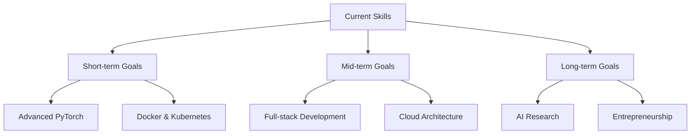

## Projects

### 🤖 Virtual Assistant

A comprehensive desktop assistant for Windows that helps automate daily tasks and boost productivity.

**Technologies:** Python, Speech Recognition, NLP, Windows API
**Features:**
- Voice command recognition
- Task automation
- Calendar integration
- Smart file management
- Custom reminders

[View Repository](https://github.com/Finsa-SC/Virtual-Assistans) | [Live Demo](#)

### 🚀 GitHub Auto Uploader

Streamlines the GitHub workflow by automating commits and uploads, perfect for continuous project updates.

**Technologies:** Python, Git API, Task Scheduling
**Features:**
- Automated commit generation
- Customizable upload schedules
- Change detection
- Configurable ignored files
- Commit message templates

[View Repository](https://github.com/Finsa-SC/-AutoGitHub-Uploader-) | [Documentation](#)

---

## 📚 Education
- **SMK [School Name]** - Software Engineering (Expected graduation: 2026)
  - Relevant coursework: Database Systems, Object-Oriented Programming, Web Development
  - School projects: [Project name] - A [brief description]

---

## 🌱 Currently Learning

---

## 🧠 Skills Roadmap

---

## 🎯 Hackathons & Events
- **[Event Name]** - [Date] - [Achievement/Role]
- **Local Code Jam** - [Date] - [Achievement/Role]

---

## 👨‍💻 Coding Activity

---

## 💼 Work Experience
- **[Company/Organization Name]** - [Position] - [Duration]
  - [Brief description of responsibilities and achievements]

---

## 🤝 Open to Collaborate On
- AI and Machine Learning projects
- Mobile app development
- Open-source initiatives
- Educational technology
- Data visualization tools

---

## ⚡ Fun Facts
- Started coding at age [X]
- Won [X] hackathons
- Contributed to [X] open-source projects
- Created [X] videos teaching programming concepts